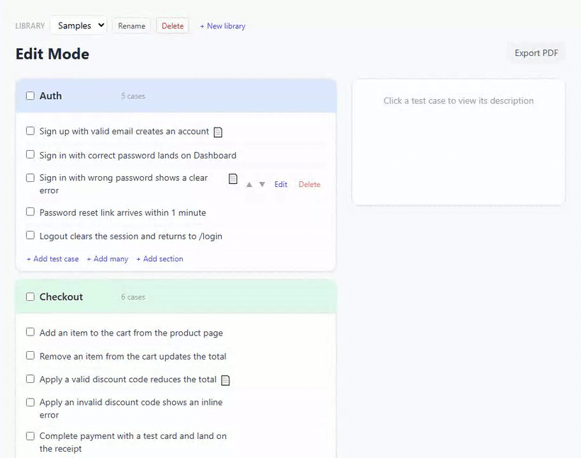
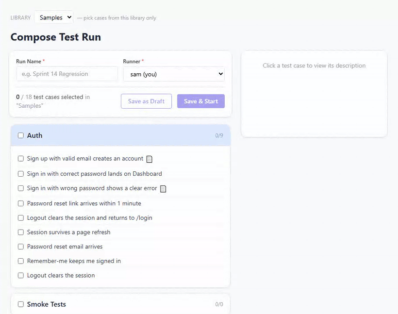

# exotick

Simple yet powerful self-hosted test case management.

- Multiple test case libraries, sections and cases with markdown notes and pasted images
- Compose runs from any subset in a selected library
- Mark pass/fail live. Don't mark to skip on finish
- PDF export for completed test runs, backup import/export
- User roles with limited permissions

One process, one SQLite file. Runs on a laptop, a LAN box, or a VPS. For small teams and basic needs.

---

## Showcase

**Build a library** — add cases one at a time or in bulk, and organize them into sections or leave unsectioned:



**Compose & run** — select cases across sections, start the run, and mark pass/fail live:



More screenshots — bulk edit, editing a case, branding — are in [`docs/screens`](docs/screens).

---

## Install

Requirements: **Node.js 24+**.

```bash
git clone https://github.com/hook-dll/exotick.git
cd exotick
npm run setup     # installs root + client + server deps
npm run dev       # starts backend :3001 + client :5173
```

Open http://localhost:5173.

On first launch the terminal prompts for an admin username and password. Sign in via web, done. Change the admin password later at **Settings › Change my password**. Locked out? See [password recovery](docs/administration.md#password-recovery). Add teammates at **Settings › Users**.

For Docker or headless boot, `EXOTICK_ADMIN_USERNAME` + `EXOTICK_ADMIN_PASSWORD` env vars replace the prompt — see [Deployment](docs/deployment.md).

---

## Features at a glance

- **Libraries** — sections and cases grouped into named libraries; runs are scoped to one library.
- **Editing** — markdown notes, inline images, and bulk create / move / duplicate / delete / merge.
- **Run lifecycle** — compose → mark pass/fail live → take over → finish, with contributors tracked per mark.
- **History & PDF export** — every completed run, filterable, exportable (with non-Latin scripts supported).
- **Roles** — `admin / editor / runner / watcher` with distinct edit, run, and manage capabilities.
- **Backup & branding** — per-library `.zip` import/export and a custom app name + logo.
- **Secure by default** — scrypt hashing, hashed session cookies, and progressive login rate-limiting.

See the full [feature reference](docs/features.md) for the details behind each.

---

## Documentation

- [Features](docs/features.md) — every feature, the run lifecycle, and the roles matrix
- [Deployment](docs/deployment.md) — LAN, Docker, and HTTPS / reverse proxy
- [Configuration](docs/configuration.md) — environment variables and data layout
- [Administration](docs/administration.md) — managing users and password recovery
- [Security](docs/security.md) — hashing, sessions, rate limits, and the auth model

---

## License

exotick is **source-available** (not open source): the **MIT License with the [Commons Clause](https://commonsclause.com/) condition**. You're free to use, run, self-host, modify, and share it — including inside a company or for your own commercial work — at no cost. You may **not sell** it (resell the software, or offer it as a paid hosted service). See [LICENSE](LICENSE) for the exact terms.

---

## About me

I've been working in testing for over 10 years now. Not a fan of the current commercial solutions on the test management system market. Claude Code helped me build the system I wanted for myself, slightly exotic one. I want to share it with you in case it works for you too.
